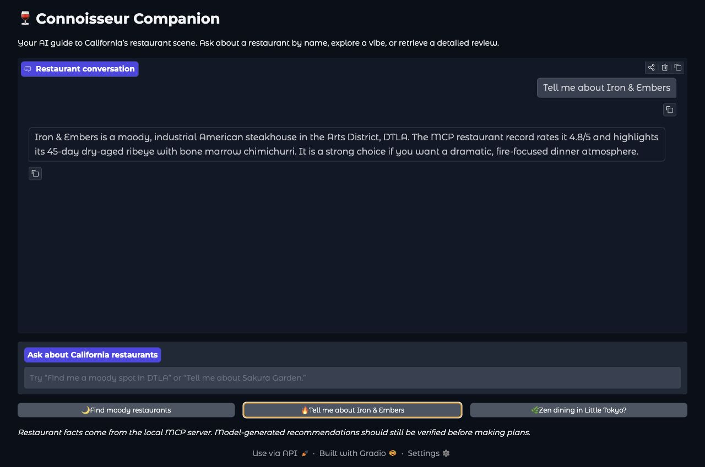
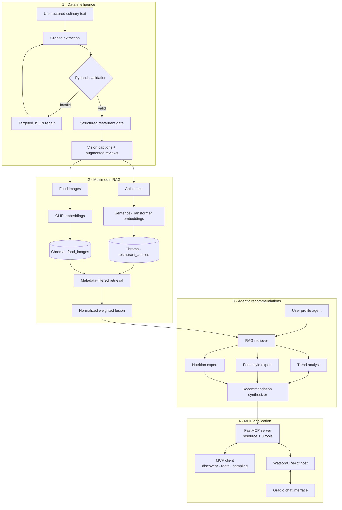
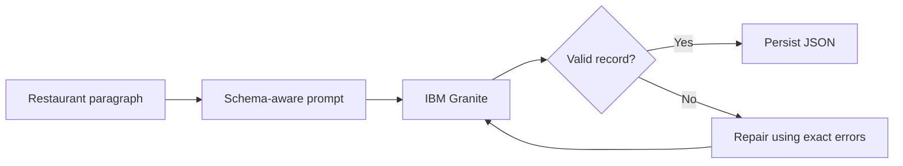
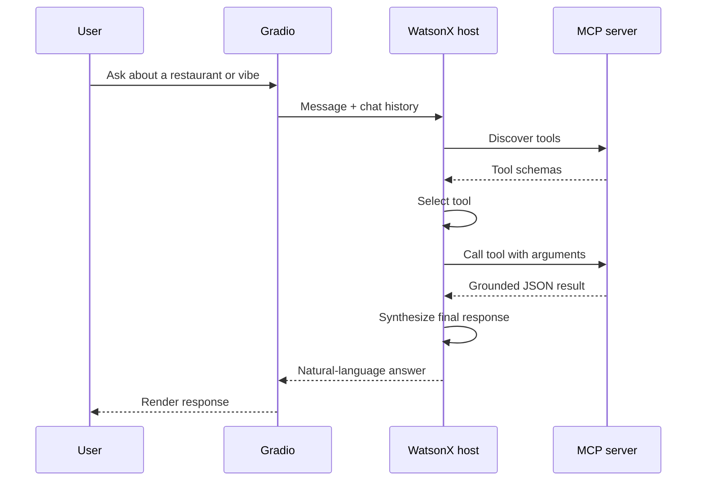

<div align="center">

# 🍽️ Connoisseur AI

### From raw restaurant descriptions to a multimodal, multi-agent MCP application

An end-to-end AI engineering portfolio built from IBM's RAG and Agentic AI
coursework—covering structured generation, multimodal retrieval, agent
orchestration, Model Context Protocol tools, and a WatsonX-powered chat
experience.

[](https://www.python.org/)
[](https://www.ibm.com/products/watsonx-ai)
[](#the-12-lab-journey)
[](#quality-and-testing)
[](#model-context-protocol)
[](LICENSE)

[Explore the labs](#the-12-lab-journey) ·
[See the architecture](#system-architecture) ·
[Run the project](#quick-start) ·
[Read the technical guide](docs/lab-guide.tex)

</div>

---



## The idea

**Connoisseur AI** is a restaurant intelligence system that grows across 12
connected labs. It starts by converting messy culinary descriptions into
validated JSON. It then enriches that data with image captions, indexes text
and images in Chroma, retrieves and reranks relevant results, coordinates
specialized recommendation agents, and finally exposes the entire capability
through MCP to a conversational Gradio application.

This repository is more than a collection of notebooks. The course exercises
have been rebuilt as a cohesive Python package with:

- reusable modules instead of isolated cells;
- typed data contracts and bounded LLM repair loops;
- deterministic offline tests that do not consume inference credits;
- local-first interfaces and explicit secret management;
- course-compatible entry points for every major deliverable;
- individual design notes for all 12 labs.

> **Project status:** all 12 labs are implemented and the complete MCP host
> application is ready to run.

## What can it do?

Ask a natural-language question such as:

> *“Find me a moody California restaurant, explain why it fits, and show me a
> detailed review.”*

The final application can:

1. understand whether the request needs a restaurant lookup, vibe search, or
   review;
2. discover the available tools from the MCP server at runtime;
3. let the WatsonX model choose and call the appropriate tools;
4. feed tool results back into a bounded ReAct loop;
5. synthesize a grounded, conversational answer in the Gradio UI.

Earlier layers also support semantic article search, image-to-image retrieval,
metadata filtering, weighted multimodal fusion, profile generation, dietary
analysis, and restaurant/recipe recommendation workflows.

## System architecture



### Why this architecture matters

| Layer | Engineering problem | Solution demonstrated |
|---|---|---|
| Data | LLM output can be malformed or incomplete | Schema-first prompts, Pydantic validation, targeted repair, bounded retries |
| Retrieval | Text and images live in different embedding spaces | Separate Chroma collections with modality-specific embedding models |
| Ranking | Raw distances are not directly comparable | Per-modality normalization and explainable weighted fusion |
| Agents | One prompt should not own every responsibility | Specialized agents with explicit roles, goals, and state contracts |
| Integration | Tools should be reusable by different AI clients | MCP resources, typed tools, discovery, roots, and sampling |
| Experience | Tool orchestration should feel natural to users | A bounded ReAct loop behind a responsive Gradio chat interface |

## The 12-lab journey

Each lab is independently documented, but every one contributes to the final
system.

| Module | Lab | What was built | Core concepts |
|---|---:|---|---|
| **Structured data** | 01 | [Reliable restaurant extraction](projects/01-structured-restaurant-extraction.md) | IBM Granite, one-shot prompting, Pydantic, JSON repair |
| | 02 | [Multimodal food-data augmentation](projects/02-multimodal-food-data-augmentation.md) | Vision LLMs, image captioning, contextual enrichment |
| | 03 | [Safe restaurant database](projects/03-safe-restaurant-database.md) | CRUD, typed edits, backups, LLM-assisted entry |
| **Multimodal RAG** | 04 | [Multimodal vector index](projects/04-multimodal-vector-index.md) | Chroma, Sentence-Transformers, CLIP, persistence |
| | 05 | [Similarity retrieval](projects/05-similarity-retrieval.md) | Top-K search, image retrieval, metadata filters |
| | 06 | [Fusion and reranking](projects/06-multimodal-fusion-ranking.md) | Score normalization, weighting, candidate fusion |
| **Agentic AI** | 07 | [Specialized recommendation agents](projects/07-specialized-recommendation-agents.md) | Roles, goals, backstories, task contracts |
| | 08 | [Multi-agent recommendation workflow](projects/08-multi-agent-recommendation-workflow.md) | LangGraph, shared state, parallel analysis |
| | 09 | [Interactive recommendation chatbot](projects/09-gradio-recommendation-chatbot.md) | Intent routing, preference extraction, Gradio |
| **MCP** | 10 | [Connoisseur MCP server](projects/10-connoisseur-mcp-server.md) | FastMCP resources, typed tools, stdio |
| | 11 | [Connoisseur MCP client](projects/11-connoisseur-mcp-client.md) | Discovery, roots, Anthropic sampling |
| | 12 | [Full MCP host application](projects/12-full-mcp-host-application.md) | WatsonX, ReAct, runtime tool binding, streaming UI |

For a chapter-by-chapter explanation of the implementation and learning goals,
see the [LaTeX lab guide](docs/lab-guide.tex).

## Project highlights

### Reliable structured generation

The extraction pipeline never assumes that model output is valid. Responses
are parsed into typed Pydantic models, validation errors become focused repair
prompts, and retries are capped so failures remain observable.



### Multimodal retrieval and ranking

Text and images are indexed in separate collections because their vector
dimensions and semantics differ. Search results are filtered by metadata,
converted from distance to similarity, normalized within each modality, and
combined with tunable weights.

```python
rows = fuse_rank(
    "handmade pasta and romantic dinner",
    w_text=0.6,
    w_img=0.4,
    where_text={"location": "Pasadena"},
    where_img={"source": "recipe_image"},
    top_n=5,
)
```

### Parallel multi-agent reasoning

The recommendation workflow is sequential where dependencies matter and
parallel where they do not:

```text
User input
   └── Profile generator
         └── RAG retriever
               ├── Trend analyst ─────┐
               ├── Food style expert ├── Recommendation synthesizer
               └── Nutrition expert ─┘
```

Each agent receives a focused task, while a shared state object records the
workflow's progress and makes intermediate results inspectable.

### Model Context Protocol

The FastMCP server turns the restaurant data layer into discoverable,
interoperable capabilities:

| MCP component | Name | Purpose |
|---|---|---|
| Resource | `culinary-map://california` | Read the complete raw culinary map |
| Tool | `get_restaurant_info` | Search restaurant records by partial name |
| Tool | `recommend_by_vibe` | Search structured tags and raw text by atmosphere |
| Tool | `get_review` | Retrieve a complete augmented review |

The client verifies discovery, declares the project directory as its permitted
filesystem root, and can fulfill server-delegated sampling requests without
placing model credentials on the server.

### ReAct-powered host

The final host does not hard-code a tool choice. It discovers MCP schemas,
binds them to the WatsonX model, and repeats a controlled
**reason → act → observe** cycle until the model returns a final answer.



## Technology stack

| Area | Technologies |
|---|---|
| Models | IBM Granite / watsonx.ai, OpenAI-compatible chat models, Anthropic sampling |
| Validation | Pydantic, JSON schema, bounded repair loops |
| Embeddings | Sentence-Transformers `all-MiniLM-L6-v2`, OpenAI CLIP ViT-B/32 |
| Vector store | Chroma, LangChain Chroma |
| Orchestration | LangGraph, `ThreadPoolExecutor`, explicit shared state |
| Protocol | FastMCP 3.1, MCP Python SDK, stdio transport |
| Interface | Gradio 6 |
| Engineering | Python 3.11+, pytest, Ruff, editable package installs |
| Documentation | Markdown, Mermaid, LaTeX |

## Quick start

### 1. Clone and create an environment

```bash
git clone https://github.com/Djordje3002/ibm-rag-agentic-ai-showcase.git
cd ibm-rag-agentic-ai-showcase

python -m venv .venv
source .venv/bin/activate
python -m pip install --upgrade pip
```

### 2. Choose the part you want to run

```bash
# Core extraction pipeline and developer tools
pip install -e ".[dev,labs]"

# Multimodal vector index and retrieval
pip install -e ".[vector,dev]"

# Multi-agent workflow and chatbot
pip install -e ".[agents,openai,ui,dev]"

# MCP server, client, WatsonX host, and UI
pip install -e ".[mcp,host,ui,dev]"
```

> Lab 04 downloads larger embedding models on first use. On Linux CPU systems,
> installing the CPU PyTorch wheel before the `vector` extra may save space.

### 3. Configure credentials

```bash
cp .env.example .env
```

Use environment variables; never commit secrets.

```bash
export WATSONX_PROJECT_ID="your-project-id"
export WATSONX_APIKEY="your-api-key"

# Only needed when using Anthropic sampling in the MCP client:
export ANTHROPIC_API_KEY="your-api-key"
```

### 4. Launch the final application

Prepare the course data in `data/raw/` as described in
[Lab 10](projects/10-connoisseur-mcp-server.md), then run:

```bash
python app.py
```

Open the local Gradio URL printed in the terminal and try:

- `Find me some moody restaurants.`
- `Tell me about Iron & Embers.`
- `What's a zen dining experience in Little Tokyo?`

The app is local-only by default. Set `GRADIO_SHARE=true` only when you
intentionally want a temporary public Gradio link.

## Run individual layers

### Structured extraction

```bash
restaurant-extract --limit 3
```

The command downloads the source dataset when needed and writes validated
records to `data/processed/structured_restaurant_data.json`.

### Safe restaurant database

```bash
restaurant-db
```

### Multimodal index

```bash
build-multimodal-index
```

### Recommendation chatbot

```bash
python examples/09_gradio_recommendation_chatbot.py --launch
```

### MCP server verification

```bash
python test.py
```

This starts `server.py` over stdio, discovers the server, and calls
`get_restaurant_info` with a partial restaurant name.

### Complete MCP client

```bash
python client.py
```

The client exercises all three tools and verifies the resource, configured
root, and discovered schemas.

### MCP host application

```bash
connoisseur-app
```

## Repository map

```text
.
├── app.py                         # Final WatsonX + MCP + Gradio application
├── client.py                      # Full MCP client and discovery demo
├── server.py                      # Course-compatible FastMCP server
├── test.py                        # Independent stdio verification client
├── examples/                      # Step-by-step runnable lab scripts
├── projects/                      # Design notes for all 12 labs
├── docs/
│   ├── lab-guide.tex              # Printable lab-by-lab technical guide
│   └── screenshots/               # Verified project evidence and UI captures
├── src/ibm_rag_agentic_showcase/
│   ├── restaurant_extraction.py   # Prompting, validation, and repair
│   ├── multimodal_augmentation.py # Vision captions and enrichment
│   ├── restaurant_database.py     # Safe CRUD and CLI
│   ├── multimodal_vector_index.py # Text/image embeddings and Chroma
│   ├── similarity_retrieval.py    # Filtered semantic retrieval
│   ├── multimodal_fusion.py       # Cross-modal score fusion
│   ├── specialized_agents.py      # Agent specifications
│   ├── recommendation_workflow.py # Stateful multi-agent orchestration
│   ├── chatbot_interface.py       # Recommendation chat service
│   ├── mcp_server.py              # MCP resource and tools
│   ├── mcp_client.py              # Roots, sampling, and tool calls
│   └── mcp_host.py                # ReAct loop and final UI
└── tests/                         # Offline, deterministic test suite
```

## Quality and testing

```bash
pytest
ruff check .
ruff format --check .
```

Current verification:

- **77 tests passing**
- **40 Python files format-clean**
- no WatsonX, OpenAI, or Anthropic call required by the test suite;
- fake model and protocol objects cover failure paths without spending credits;
- data writes use explicit paths, validation, and backup behavior.

## Design principles

- **Treat model output as untrusted input.** Parse, validate, repair, or fail
  clearly.
- **Keep modalities explicit.** Text and images have separate embeddings,
  stores, and scores.
- **Make ranking explainable.** Normalization and weights remain visible and
  tunable.
- **Give agents narrow responsibilities.** Specialized prompts are easier to
  test and reason about.
- **Discover tools at runtime.** MCP keeps the data layer reusable across
  clients and hosts.
- **Prefer local and reversible defaults.** Public sharing is opt-in, secrets
  stay in environment variables, and generated data is ignored by Git.

## Limitations and next steps

This is an educational portfolio project, not a production restaurant service.
The course dataset is static, recommendation quality depends on the configured
model, and local CLIP inference can be resource-intensive.

Natural next steps include:

- replacing simulated retrieval in the agent lab with the persistent Chroma
  index everywhere;
- adding evaluation datasets for retrieval precision and recommendation
  quality;
- tracing model/tool calls with latency and token metrics;
- containerizing the MCP server and UI;
- adding authentication, rate limits, and persistent user profiles.

## Documentation

- [Complete LaTeX lab guide](docs/lab-guide.tex)
- [Lab 01 — Structured extraction](projects/01-structured-restaurant-extraction.md)
- [Lab 04 — Multimodal vector index](projects/04-multimodal-vector-index.md)
- [Lab 08 — Multi-agent workflow](projects/08-multi-agent-recommendation-workflow.md)
- [Lab 10 — MCP server](projects/10-connoisseur-mcp-server.md)
- [Lab 11 — MCP client](projects/11-connoisseur-mcp-client.md)
- [Lab 12 — Full MCP application](projects/12-full-mcp-host-application.md)

## Responsible use

API keys belong in environment variables and must never be committed. Model
output is validated before persistence, repair attempts are bounded, and the
application does not create a public Gradio link unless explicitly requested.
Restaurant recommendations should be independently checked for current hours,
availability, allergens, and dietary requirements.

## Acknowledgements

Built while completing IBM coursework in retrieval-augmented generation,
multimodal AI, agentic systems, and Model Context Protocol integration. The
restaurant descriptions originate from the IBM Skills Network course dataset
and are downloaded at runtime rather than redistributed as authoritative live
restaurant information.

## License

Released under the [MIT License](LICENSE).

<div align="center">

**Built from raw data to a working AI application—one lab at a time.**

</div>
