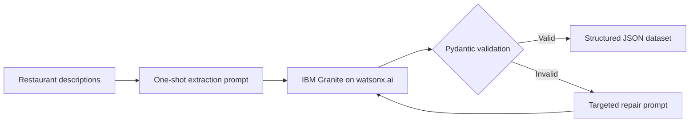

# IBM RAG & Agentic AI Showcase

Hands-on projects from IBM's RAG and Agentic AI coursework, rebuilt as a
portfolio-ready collection of reproducible AI engineering patterns.

> **Status:** Labs 01 through 11 are ready, from structured extraction through
> a complete MCP client–server application.

## Projects

| # | Project | Concepts | Status |
|---|---|---|---|
| 01 | [Structured restaurant extraction](projects/01-structured-restaurant-extraction.md) | IBM Granite, one-shot prompting, Pydantic validation, JSON self-repair | Complete |
| 02 | [Multimodal food-data augmentation](projects/02-multimodal-food-data-augmentation.md) | Vision-language models, image captioning, contextual enrichment, resilient downloads | Complete |
| 03 | [Safe restaurant database](projects/03-safe-restaurant-database.md) | CRUD, LLM-assisted entry, typed edits, backups, unit testing | Complete |
| 04 | [Multimodal vector index](projects/04-multimodal-vector-index.md) | Sentence-Transformers, CLIP, LangChain documents, persistent Chroma collections | Complete |
| 05 | [Similarity retrieval with metadata filtering](projects/05-similarity-retrieval.md) | Text similarity, image similarity, metadata filters, result inspection | Complete |
| 06 | [Multimodal fusion and ranking](projects/06-multimodal-fusion-ranking.md) | Score normalization, weighted fusion, filtered candidate pools, reranking | Complete |
| 07 | [Specialized recommendation agents](projects/07-specialized-recommendation-agents.md) | Six single-purpose agents, ReAct, few-shot prompts, task contracts | Complete |
| 08 | [Multi-agent recommendation workflow](projects/08-multi-agent-recommendation-workflow.md) | LangGraph state, sequential/parallel phases, synthesis, evaluation | Complete |
| 09 | [Interactive recommendation chatbot](projects/09-gradio-recommendation-chatbot.md) | Gradio 6, intent routing, session preferences, workflow integration, catalog CRUD | Complete |
| 10 | [Connoisseur MCP data server](projects/10-connoisseur-mcp-server.md) | FastMCP, resources, typed tools, stdio transport, protocol testing | Complete |
| 11 | [Connoisseur MCP client](projects/11-connoisseur-mcp-client.md) | Discovery, roots, Anthropic sampling, stdio subprocesses, tool calls | Complete |

A printable, chapter-by-chapter explanation is maintained in
[the LaTeX lab guide](docs/lab-guide.tex).

## Project 01: From unstructured text to reliable JSON

The first project converts free-form restaurant descriptions into typed,
machine-readable records. It uses an IBM Granite model for extraction, validates
every response with Pydantic, and asks the model to repair malformed output
within a bounded retry loop.



### What this demonstrates

- Constrained generation with an explicit JSON schema
- One-shot prompting with a representative example
- Runtime validation rather than trusting model output
- Automatic repair informed by exact validation errors
- Bounded retries and clear failure behavior
- Separation between model access, extraction logic, and file I/O

## Quick start

Prerequisites:

- Python 3.11+
- An IBM watsonx.ai project and API key, or the IBM Skills Network lab runtime

```bash
git clone https://github.com/Djordje3002/ibm-rag-agentic-ai-showcase.git
cd ibm-rag-agentic-ai-showcase

python -m venv .venv
source .venv/bin/activate
pip install -e ".[dev,labs]"

cp .env.example .env
# Add your watsonx.ai values, then export them into your shell.

restaurant-extract --limit 3
```

By default, the command downloads the course dataset and writes the validated
records to `data/processed/structured_restaurant_data.json`. Generated data is
ignored by Git so that the repository stays small and reproducible.

## Repository layout

```text
.
├── examples/                    # Course concepts in a step-by-step script
├── docs/lab-guide.tex           # One evolving explanation of every lab
├── projects/                    # Project write-ups and design notes
├── src/ibm_rag_agentic_showcase/
│   ├── restaurant_extraction.py # Schema, prompts, validation, repair pipeline
│   ├── multimodal_augmentation.py # Vision captioning and data enrichment
│   ├── restaurant_database.py   # Safe CRUD and terminal interface
│   ├── multimodal_vector_index.py # Text/image embeddings and Chroma
│   ├── similarity_retrieval.py  # Filtered text and image retrieval
│   ├── multimodal_fusion.py      # Cross-modal score fusion and reranking
│   ├── specialized_agents.py     # Standalone agent specifications
│   ├── recommendation_workflow.py # Stateful multi-agent orchestration
│   ├── chatbot_interface.py      # Gradio chat service and catalog UI
│   ├── mcp_server.py             # Culinary resource and search tools
│   ├── mcp_client.py             # Discovery, roots, sampling, and demos
│   └── cli.py                   # Reproducible command-line entry point
├── server.py                    # Course-compatible MCP server entry point
├── test.py                      # Independent stdio MCP client verification
├── client.py                    # Complete MCP client demonstration
└── tests/                       # Offline unit tests with a fake LLM
```

## Run the checks

```bash
pytest
```

The test suite does not call watsonx.ai, so it is fast, deterministic, and does
not consume inference credits.

To run the Lab 09 interface locally:

```bash
pip install -e ".[agents,openai,ui,dev]"
python examples/09_gradio_recommendation_chatbot.py --launch
```

The demo binds to `127.0.0.1` and does not create a public sharing link.

To prepare and verify the Lab 10 MCP server:

```bash
pip install -e ".[mcp,dev]"

curl -L "https://cf-courses-data.s3.us.cloud-object-storage.appdomain.cloud/_nbA_KMj1n7yBrpfz8rYkg/California-Culinary-Map.txt" \
  -o data/raw/California-Culinary-Map.txt
curl -L "https://cf-courses-data.s3.us.cloud-object-storage.appdomain.cloud/lxfhTQUrDCCD_JSMmr92VA/structured-restaurant-data.json" \
  -o data/raw/structured-restaurant-data.json
curl -L "https://cf-courses-data.s3.us.cloud-object-storage.appdomain.cloud/oMqDIzTBNFT7KKJ0GW4-Cw/augmented-user-review.json" \
  -o data/raw/augmented-user-review.json

python test.py
```

The client starts `server.py` on demand over stdio, discovers its components,
and calls `get_restaurant_info` with the partial name `Iron`.

Run the complete Lab 11 client after preparing the same data:

```bash
python client.py
```

The client calls all three tools and then prints the discovered tools, resource,
and encoded project root. `ANTHROPIC_API_KEY` is needed only if a server
actually delegates a sampling request to the client.

Lab 04 uses larger local ML dependencies. Install a CPU build of PyTorch first
on Linux, then install the vector extra:

```bash
pip install torch --index-url https://download.pytorch.org/whl/cpu
pip install -e ".[vector,dev]"
```

On macOS, the regular `pip install -e ".[vector,dev]"` command installs the
native PyTorch build.

To build the lab guide when a LaTeX distribution is installed:

```bash
pdflatex -output-directory docs docs/lab-guide.tex
pdflatex -output-directory docs docs/lab-guide.tex
```

## Responsible use

Model output is treated as untrusted input. The pipeline validates all records
before saving them, caps repair attempts, and raises a clear error if a response
still does not satisfy the schema. API keys belong in environment variables and
must never be committed.

## Acknowledgements

Built while completing IBM coursework in retrieval-augmented generation and
agentic AI. The restaurant descriptions are provided by the IBM Skills Network
course dataset and are downloaded at runtime rather than redistributed here.

## License

Code in this repository is available under the [MIT License](LICENSE).
