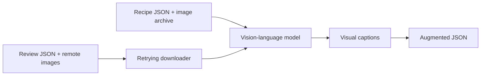

# Project 02 — Multimodal Food-Data Augmentation

## Problem

Images contain useful details about ingredients, presentation, atmosphere, and
customer experience, but a text-only retrieval system cannot search those
details. This lab converts visual information into concise text captions and
adds them to existing recipe and restaurant-review records.

## Inputs and outputs

| Input | Enrichment | Output field |
|---|---|---|
| 109 recipe records and recipe images | Caption based on dish name and pixels | `image_description` |
| 10 synthetic user reviews with image URLs | Caption based on review text and pixels | `image_captions` |

The original fields remain unchanged, making the augmented JSON suitable for
later embedding, indexing, and multimodal retrieval.

## Pipeline



## Engineering improvements

- Reuses one watsonx.ai model client instead of recreating it per image.
- Derives recipe image paths from the archive's `recipe<ID>.png` convention.
- Reads review context from the live dataset's `text` field.
- Detects the correct image MIME type for multimodal data URLs.
- Uses safe ZIP extraction with traversal and symlink checks.
- Retries transient review-image failures with bounded exponential backoff.
- Defaults to a three-record preview to avoid unexpected inference costs.
- Separates model access, prompts, downloads, enrichment, and JSON persistence.

## Run the lab

```bash
pip install -e ".[labs]"
export WATSONX_APIKEY="..."
export WATSONX_PROJECT_ID="..."

# Open examples/02_multimodal_food_data_augmentation.py as notebook cells.
```

The recipe image archive is approximately 215 MB. Generated and downloaded
assets are stored under `data/`, which is excluded from Git.

Set `LAB02_LIMIT=0` before running the example to process every record. Leave
the variable unset for the low-cost three-record preview.

## Connection to RAG

The captions bridge visual data and text retrieval. A later RAG pipeline can
embed the generated descriptions alongside recipe metadata and review text,
allowing natural-language queries to retrieve evidence that originally existed
only in images.
