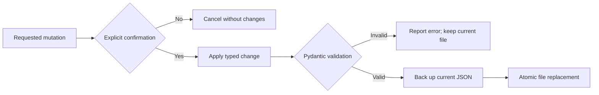

# Project 03 — Safe Restaurant Database

## Problem

Lab 01 creates a structured restaurant dataset, but a static JSON file is not a
usable application. Lab 03 adds a terminal interface for browsing and modifying
that data while preserving schema validity and creating a backup before every
write.

## Capabilities

| Action | Behavior |
|---|---|
| Browse | Lists restaurant names without calling watsonx.ai |
| View | Displays every field in one validated record |
| Add | Uses the Lab 01 Granite pipeline to structure a new description |
| Edit | Parses terminal input into typed values and validates the full record |
| Delete | Requires explicit write-mode confirmation before removal |

## Data-safety flow



## Engineering improvements

- Reuses the bounded extraction and repair pipeline from Lab 01.
- Allocates IDs from the current maximum rather than the record count.
- Validates loaded data as well as newly entered data.
- Converts numeric, nullable, and list edits to their proper types.
- Writes through a temporary file and atomically replaces the database.
- Creates a backup immediately before each successful mutation.
- Initializes the cloud model only when the user adds a record.
- Separates CRUD logic from terminal input for deterministic offline tests.

## Run the application

Start with the structured output from Lab 01:

```bash
restaurant-extract --limit 5
restaurant-db --file data/processed/structured_restaurant_data.json
```

The database can be browsed, edited, or deleted without cloud access. Adding a
new natural-language description requires valid watsonx.ai credentials outside
the IBM Skills Network environment.

## Testing strategy

Tests use temporary files and fake extraction functions. They verify backups,
ID allocation, typed edits, deletion, confirmation cancellation, and file
persistence without consuming inference credits.
