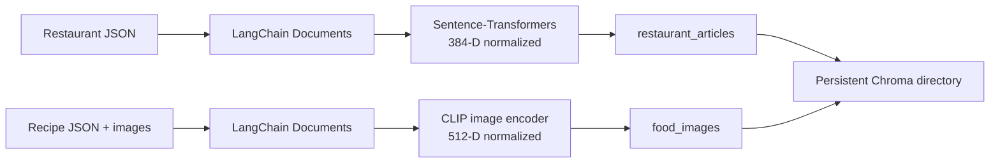

# Project 04 — Construct a Multimodal Vector Index

## Problem

The earlier labs produce structured restaurant text and captioned recipe data,
but semantic retrieval requires vector representations and an index. Lab 04
builds two persistent Chroma collections that preserve the distinct geometry of
the text and image embedding models.

## Collections

| Collection | Input | Model | Dimensions |
|---|---|---|---|
| `restaurant_articles` | Structured restaurant articles | `all-MiniLM-L6-v2` | 384 |
| `food_images` | Recipe image pixels | `clip-vit-base-patch32` | 512 |

All vectors are checked for the correct shape, finite values, and unit L2 norm
before being written.

## Requirement coverage

- **Dependencies:** the example imports and prints versions for PyTorch,
  LangChain Core, Chroma, Sentence-Transformers, Transformers/CLIP, Pillow, and
  NumPy.
- **Data loading:** restaurant and augmented recipe JSON are loaded as arrays,
  validated, and their record counts are printed before model initialization.
- **Embedding models:** `all-MiniLM-L6-v2` is required to report 384 dimensions;
  `clip-vit-base-patch32` is required to report 512. Both adapters normalize
  every batch and the index rejects non-unit vectors.
- **Documents:** LangChain `Document` objects contain retrieval text and the
  requested cuisine, location, image path, source, and stable-ID metadata.
- **Persistence:** the build creates and verifies the `restaurant_articles` and
  `food_images` Chroma collections in one persistent local directory.

## Pipeline



## Retrieval metadata

Restaurant documents include stable item ID, name, location, restaurant type,
food style, and `source=restaurant_article`.

Recipe-image documents include recipe ID, name, cuisine, absolute image path,
and `source=recipe_image`. Metadata values are scalar so Chroma can filter them
without lossy serialization.

## Why two collections?

The 384-D Sentence-Transformers vectors and 512-D CLIP vectors do not share a
coordinate system. Mixing them would be mathematically invalid. Separate
collections make the model-to-collection relationship explicit and allow each
query to use the matching encoder.

CLIP's image and text encoders do share a coordinate system. The lab therefore
supports text-to-image retrieval by embedding a natural-language query with
CLIP's text encoder and searching `food_images`.

## Reliability

- CPU execution is explicit and reproducible.
- Embedding dimensions are checked when models initialize.
- Every batch is checked for shape, finite values, and L2 normalization.
- Collection IDs derive from stable restaurant and recipe identifiers.
- Duplicate IDs are rejected before indexing.
- Rebuild mode deletes only the two Lab 04 collections.
- Batched upserts make reruns deterministic and memory-conscious.
- Generated Chroma files remain under the Git-ignored `data/indexes/` path.

## Run

Complete Labs 01 and 02 first. Then install the vector dependencies.

```bash
# Linux CPU environment:
pip install torch --index-url https://download.pytorch.org/whl/cpu
pip install -e ".[vector]"

# Build a small smoke-test index:
build-multimodal-index --limit 10

# Build the complete index:
build-multimodal-index
```

The initial run downloads both embedding models. Later runs reuse the local
model cache and persistent Chroma directory.
