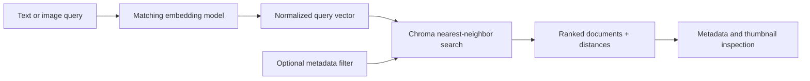

# Project 05 — Similarity Retrieval with Metadata Filtering

## Problem

A vector index is useful only when applications can retrieve from it safely and
interpret the results. Lab 05 queries both Lab 04 collections, combines semantic
similarity with exact metadata constraints, and presents compact result details
for inspection.

## Demonstrations

| Demo | Query | Collection | Optional filter |
|---|---|---|---|
| 1 | Restaurant text | `restaurant_articles` | None |
| 2 | Restaurant text | `restaurant_articles` | `location` |
| 3 | Recipe image | `food_images` | `cuisine` |

## Retrieval flow



## Metadata filtering

Vector similarity answers “which records are semantically or visually close?”
Metadata filtering adds a hard constraint such as “only restaurants in
Pasadena” or “only recipes from this cuisine.” Chroma applies the filter before
returning nearest neighbors.

The example first inspects actual stored metadata. It prefers the requested
location when available and otherwise selects a value that exists. This avoids
confusing an impossible filter with a retrieval failure.

## Image-to-image retrieval

The selected recipe image is embedded with the same CLIP image encoder used
during indexing. Its normalized 512-D query vector is compared with vectors in
`food_images`. The closest records include their source image paths, allowing
the notebook to display retrieved thumbnails alongside cuisine and distance.

## Engineering improvements

- Uses public `langchain-chroma` APIs rather than private collection internals.
- Refuses to create missing collections while opening the database.
- Verifies both collections are nonempty before loading models.
- Validates query text, image existence, result count, and query index.
- Represents each result as a typed `RetrievalHit`.
- Handles filtered searches with zero results.
- Uses real stored metadata values for reproducible demos.
- Keeps distance semantics explicit: lower cosine distance is more similar.

## Run

Build the Lab 04 index first:

```bash
build-multimodal-index --limit 10
```

Then open
`examples/05_similarity_retrieval_with_metadata_filtering.py` as notebook cells.
Change `QUERY_INDEX` to explore other recipe images.
