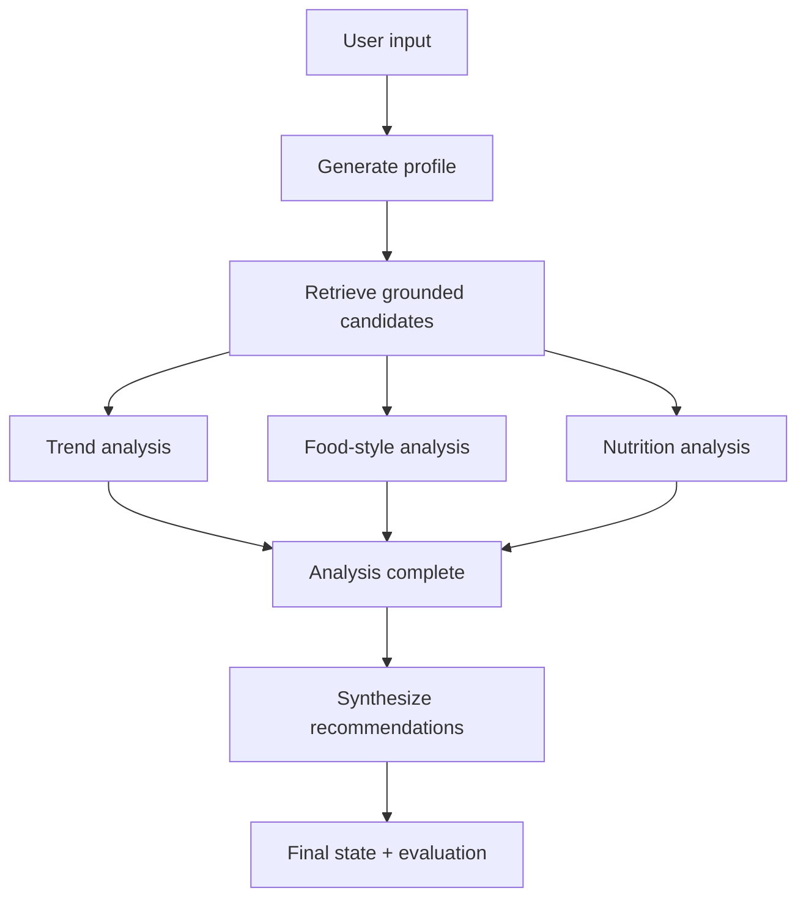

# Project 08 — Multi-Agent Recommendation Workflow

## Goal

Lab 08 connects the six specialists from Lab 07 in a stateful LangGraph. It
uses sequential phases where one result is required by the next phase and native
parallel branches where three analyses can run independently.

## Graph



## Shared state

`AgentState` tracks the original input, profile, restaurant and recipe
candidates, three specialist analyses, final recommendations, errors, and
`workflow_step`.

Nodes return only their partial updates. They do not mutate the incoming state.
The three parallel nodes update distinct fields; the `errors` field uses a list
reducer so failures from multiple branches can be accumulated safely.

### Purpose of `workflow_step`

`workflow_step` records the latest completed phase. It makes progress visible to
logs and user interfaces, helps diagnose where a run stopped, supports
conditional routing, and can participate in future checkpoint/resume logic.
LangGraph edges still define execution order; the field is observability state,
not the workflow engine.

## Grounded retrieval

The production `MultimodalCandidateRetriever` queries the real restaurant and
recipe-image collections from Lab 04. It replaces the course draft's request for
an LLM to “simulate” vector retrieval.

## Structured outputs

Each specialist response is validated with a dedicated Pydantic schema. Invalid
outputs become a scoped error and a safe empty result for that branch, allowing
the graph to finish and expose partial failure instead of silently corrupting
state.

## Evaluation

`evaluate_recommendations` returns a machine-readable report covering:

- restaurant and recipe recommendation counts;
- extracted dietary restrictions and favorite cuisines;
- reasoning coverage;
- dietary-note coverage;
- workflow errors and actionable warnings;
- a simple 0–100 completeness smoke-test score.

This is a structural evaluation, not proof that a recommendation is medically
safe or subjectively good.

## Run

```bash
pip install -e ".[agents,openai,dev]"
python examples/08_multi_agent_recommendation_workflow.py
```

The example runs without credentials using deterministic specialist and
retrieval fakes. For production, provide `ChatOpenAI` through
`LangChainJSONAgentCaller` and configure `MultimodalCandidateRetriever` with the
Lab 04 stores and embedding models.
