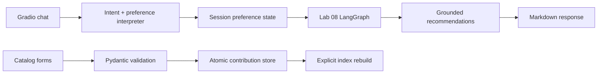

# Lab 09 — Gradio recommendation chatbot

## Goal

Expose the Lab 08 recommendation graph through a friendly web interface while
keeping routing, preference extraction, workflow execution, and persistence
independently testable.

## What the lab demonstrates

- A basic Gradio echo callback and a complete multi-tab application
- Five-way intent routing: restaurant, recipe, both, clarification, database
- Structured preference extraction with a deterministic fallback or injected
  LangChain chat model
- Per-browser preference memory through `gr.State`
- Direct invocation of the Lab 08 LangGraph workflow contract
- Markdown formatting that shows reasoning and dietary notes
- Validated restaurant and recipe contributions with atomic JSON writes
- Exact-ID updates/deletions guarded by explicit confirmation

## Architecture



The UI is deliberately thin. `RecommendationChatService` owns conversation
logic and accepts any compiled workflow exposing `invoke(state)`. This makes it
possible to test the complete route without opening a browser or spending model
credits.

## Dependency decision

The source assignment pins Gradio 4.29 alongside older LangChain packages.
Those versions predate the APIs used in Lab 08. This repository instead defines
a `ui` optional dependency for Gradio 6 and keeps the existing modern
LangChain/LangGraph extras. Gradio resolves its own compatible FastAPI and
Starlette versions.

## Run it

```bash
pip install -e ".[agents,openai,ui,dev]"
python examples/09_gradio_recommendation_chatbot.py
python examples/09_gradio_recommendation_chatbot.py --launch
```

The default example uses deterministic specialists through the real Lab 08
graph. A production deployment injects `ChatOpenAI`, the JSON agent caller, and
the persistent multimodal retriever.

## Safety and data behavior

- `share=False` and loopback-only hosting are the defaults.
- API keys are never entered through the interface or written to the catalog.
- Session preferences live only in Gradio session state.
- Catalog records are validated before saving and files are atomically replaced.
- Deletion requires both an exact record ID and a confirmation checkbox.
- New source records do not enter retrieval until the vector index is rebuilt.

## Assignment screenshot

The completed preference-extraction cell and output are captured in
`docs/screenshots/M3L3_preference_extraction_test.jpg`.
