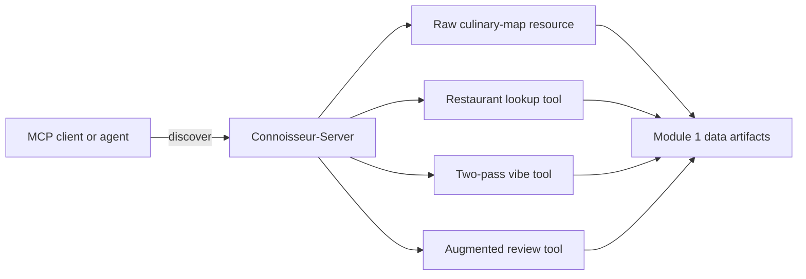

# Lab 10 — Connoisseur MCP data server

## Goal

Turn the restaurant datasets and search helpers from earlier modules into a
standard Model Context Protocol server that compatible clients and agents can
discover and call.

## Server surface

| MCP component | Name or URI | Purpose |
|---|---|---|
| Resource | `culinary-map://california` | Read the complete raw California Culinary Map |
| Tool | `get_restaurant_info` | Find structured restaurant records using a partial name |
| Tool | `recommend_by_vibe` | Search structured vibe fields and raw-map descriptions |
| Tool | `get_review` | Retrieve one complete augmented review record |



## Design

`CulinaryDataStore` resolves and validates the three generated data files.
Pure functions implement the searches, while `create_mcp_server` registers thin
protocol wrappers. This separation makes search behavior testable without a
subprocess and makes the same server testable in memory or through stdio.

The default data directory is `data/raw`. Set `IBM_MCP_DATA_DIR` to use another
directory without changing source code. Missing files, invalid JSON shapes, and
empty search queries raise clear errors instead of producing misleading broad
matches.

## Search behavior

`get_restaurant_info` performs a case-insensitive partial-name match in both
directions. Searching for `Iron` therefore returns `Iron & Embers`.

`recommend_by_vibe` is a two-pass lexical search:

1. inspect structured `vibes` and `description` fields;
2. inspect paragraphs in the unstructured culinary map.

The second pass captures atmospheric wording that was not promoted into a
formal vibe tag. This is keyword retrieval, not embedding-based semantic
search.

`get_review` returns reviewer, rating, review text, image description, and visit
date. Its completed not-found response uses the same JSON status contract as
the restaurant lookup tool.

## Run and test

Download the three course artifacts using the commands in the repository
README, then run:

```bash
pip install -e ".[mcp,dev]"
python test.py
```

`test.py` starts `server.py` using the current Python interpreter, initializes
an MCP session, verifies the advertised tools and resource, invokes
`get_restaurant_info`, and prints the JSON result between the assignment's
screenshot markers.

For an MCP-compatible client configuration, use:

```json
{
  "mcpServers": {
    "connoisseur": {
      "command": "/absolute/path/to/.venv/bin/python",
      "args": ["/absolute/path/to/server.py"]
    }
  }
}
```

## Verification

The automated suite tests:

- found and not-found restaurant lookup;
- structured and raw-text vibe matching;
- found and not-found review lookup;
- empty-query rejection;
- MCP discovery, tool invocation, and resource reading in memory; and
- a real client/server exchange over stdio.

The required terminal-output image is
`docs/screenshots/M4L1_Configure_Tools_Data_MCP_Server.jpg`.
