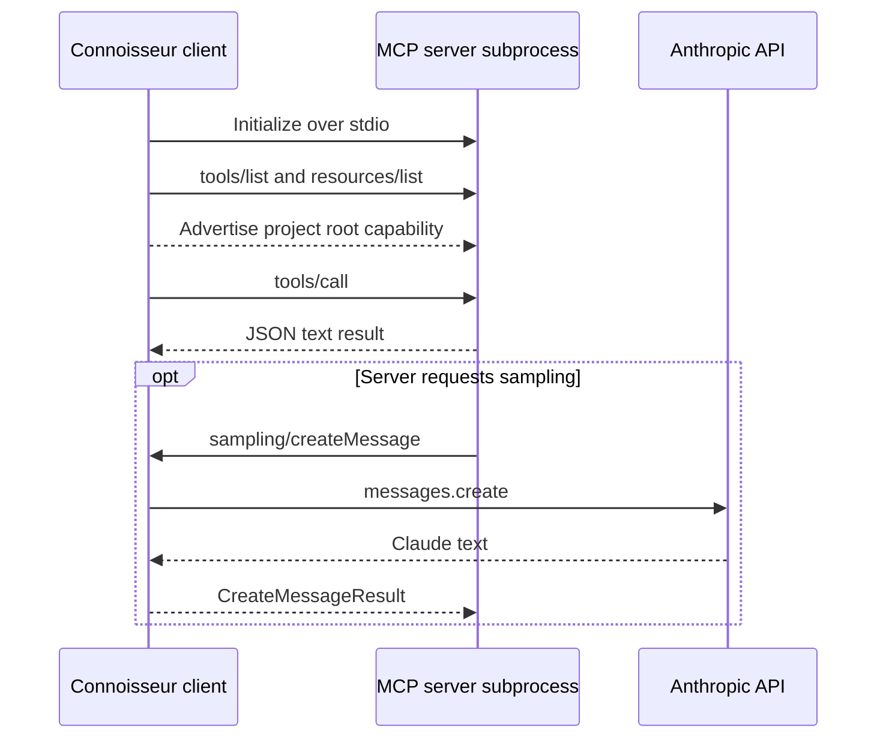

# Lab 11 — Connoisseur MCP client

## Goal

Build the client half of the Connoisseur MCP application. The client launches
the Lab 10 server as a subprocess, completes the protocol handshake, discovers
the server surface, advertises one project root, supports delegated Anthropic
sampling, and invokes all three culinary tools.

## Client workflow



## Connection and discovery

`build_server_params` uses the current Python interpreter and an absolute
`server.py` path, avoiding assumptions about the shell's `python` command or
working directory. `verify_connection` checks for the exact expected set:

- `get_restaurant_info`
- `recommend_by_vibe`
- `get_review`
- `culinary-map://california`

Unexpected or missing components fail loudly rather than producing a misleading
success message.

## Roots

`project_roots` converts the repository path with `Path.as_uri()`. This correctly
encodes spaces and other special characters. The asynchronous callback follows
the MCP 1.25 signature: it accepts a request context and returns
`ListRootsResult`.

A root tells the server which filesystem hierarchy is relevant and intended to
be shared. It is not an operating-system sandbox by itself. Server tools must
still validate paths and honor the advertised boundary.

## Sampling

The sampling callback accepts a text prompt delegated by the server, invokes
Claude, and returns an MCP `CreateMessageResult`. It:

- keeps the Anthropic API key on the client side;
- respects the requested maximum token count;
- accepts only text prompts and text responses;
- runs the synchronous Anthropic SDK call off the event loop; and
- constructs the Anthropic client lazily.

Consequently, ordinary discovery and culinary tool calls work without an API
key. `ANTHROPIC_API_KEY` is required only if the server sends a sampling
request. Sampling transmits the delegated prompt to Anthropic, so a production
client should apply consent, data-classification, logging, and model-policy
controls before enabling it.

## Shared tool helper

`call_tool` starts the server, initializes a session with both callbacks, calls
one tool, rejects MCP errors or unexpected content shapes, parses the JSON, and
requires the result to be an object. Each demonstration opens a new subprocess,
matching the course exercise and keeping lifecycle behavior easy to inspect.

## Completed demonstrations

The main entry point runs:

1. `get_restaurant_info("Iron & Embers")`
2. `recommend_by_vibe("moody")`
3. `get_review("Iron & Embers")`
4. connection and discovery verification

This completes all TODO calls from the assignment.

## Run

```bash
pip install -e ".[mcp,dev]"
python client.py
```

The three data files from Lab 10 must exist in `data/raw`. The required
discovery screenshot is stored at
`docs/screenshots/M4L2_Build_Test_MCP_Client.jpg`.

## Testing

Offline tests verify root URI encoding, the protocol callback return shape,
sampling with a fake Anthropic client, exact server discovery, screenshot
markers, and all three tool calls through real stdio subprocess sessions.
