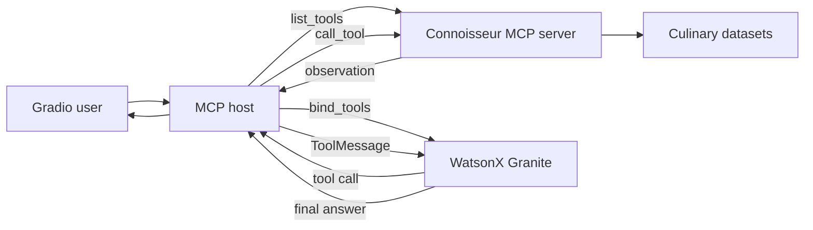

# Lab 12 — Full Connoisseur MCP host application

## Goal

Complete the MCP capstone with a user-facing host that discovers server tools at
runtime, binds their schemas to IBM Granite on watsonx.ai, executes a bounded
ReAct loop, and streams the result through Gradio.

## Architecture



## Runtime tool discovery

`PythonStdioTransport` launches `server.py`, and `Client.list_tools()` obtains
the current MCP tool surface. Each MCP input schema is converted into the
function-tool structure expected by LangChain:

```text
MCP Tool(name, description, inputSchema)
    → {"type": "function", "function": {...}}
```

No restaurant tool name or argument schema is hard-coded into the execution
loop. Adding a compatible server tool makes it available to the model on the
next request. The system prompt still describes the current tools so the model
understands their intended roles.

## ReAct loop

The bounded loop performs:

1. invoke the WatsonX model with the system prompt, history, and current request;
2. return immediately when the model produces a final answer;
3. validate each requested tool name and argument object;
4. execute valid calls through the MCP client;
5. flatten the MCP result into a `ToolMessage`; and
6. invoke the model again with that observation.

Ten iterations form a safety limit against runaway tool cycles. Unknown tools,
invalid arguments, empty results, MCP errors, and empty final answers all have
explicit behavior.

## WatsonX configuration

The host creates a fresh `ChatWatsonx` instance for each user turn. It uses:

- model: `ibm/granite-4-h-small` by default;
- endpoint: `https://us-south.ml.cloud.ibm.com`;
- project: `WATSONX_AI_PROJECT_ID` or `WATSONX_PROJECT_ID`; and
- credentials supplied through the WatsonX environment configuration.

`WATSONX_MODEL_ID` and `WATSONX_URL` can override the defaults. Model creation
is lazy, so the UI can start and be inspected without credentials. No inference
request is made until a user submits a prompt.

## Gradio interface

The interface contains:

- a complete chat window using OpenAI-style message dictionaries;
- one text input;
- a streamed `Thinking…` placeholder;
- quick starts for moody restaurants, Iron & Embers, and zen dining; and
- a reminder to verify model-generated recommendations.

The first streamed history is copied before yielding. This prevents the later
answer update from mutating the already-yielded placeholder frame.

## Deployment safety

The course example enables `share=True` unconditionally. This repository binds
to `127.0.0.1` and keeps sharing disabled by default because a public endpoint
can consume paid inference and expose data/tool behavior. Set
`GRADIO_SHARE=true` only when temporary public access is intentional. A durable
deployment should add authentication, authorization, rate limiting, audit
logging, quotas, and abuse controls.

## Run

```bash
pip install -e ".[host,ui,mcp,dev]"
export WATSONX_PROJECT_ID="..."
export WATSONX_APIKEY="..."
python app.py
```

The three Lab 10 data files must exist under `data/raw`.

## Verification

Offline tests cover schema conversion, history reconstruction, content blocks,
tool discovery, tool observations, loop limits, credential validation, streaming
history snapshots, and Gradio controls. An additional integration check uses a
fake model with the real FastMCP subprocess and confirms that the retrieved
`Iron & Embers` observation reaches the second model turn.

The UI was launched and visually inspected without calling WatsonX. The required
image is `docs/screenshots/M4L3_Design_LLM_MCP_Host.jpg`.
